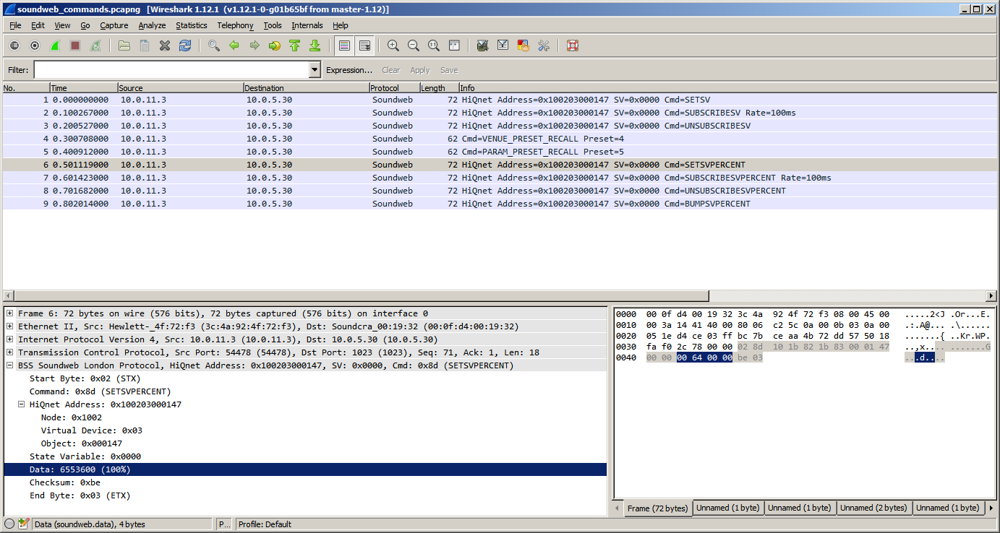

# BSS Soundweb London Protocol Wireshark Dissector

## Screenshot

## Installation

This plugin was tested with Wireshark `1.12.1`.

Copy `soundweb-dissector.lua` to `%APPDATA%\Wireshark\plugins` on Windows, or
`~/.wireshark/plugins` on Linux. For development, clone this repository to the
plugins directory. See the Wireshark [Configuration Files and Folders](https://www.wireshark.org/docs/wsug_html_chunked/ChAppFilesConfigurationSection.html)
documentation for more information.

### Coloring Rules

Adding the following [coloring rule](https://www.wireshark.org/docs/wsug_html_chunked/ChCustColorizationSection.html)
to Wireshark will highlight Soundweb packets with errors.

`View -> Coloring Rules... -> New`

    Name: Soundweb Error
    String: soundweb.error==true
    Foreground Color: #FFFFFF
    Background Color: #A40000

## Issues, Bugs, Feature Requests

Any bugs and feature requests should be reported on the GitHub issue tracker:

https://github.com/amclain/soundweb-dissector/issues

**Pull requests are preferred via GitHub.**

Mercurial users can use [Hg-Git](http://hg-git.github.io/) to interact with
GitHub repositories.

## Developer Documentation

The following section is for people who wish to modify or contribute to this
dissector. This section is not relevant to a standard installation.

### Ruby

Ruby 2.1 or higher is required to run the scripts that generate the packet
captures in the `sample_data` directory. Ruby can be obtained via the
[RubyInstaller](http://rubyinstaller.org/downloads/) for Windows, or
[rbenv](https://github.com/sstephenson/rbenv) for Linux. If installing on
Windows, make sure Ruby is in your [system path](http://www.computerhope.com/issues/ch000549.htm).

Once Ruby is installed, open the [command prompt](http://windows.microsoft.com/en-us/windows-vista/open-a-command-prompt-window)
and execute the following commands:

    gem update
    gem install ionian

In `sample_data/scripts/soundweb.rb`, set the `SOUNDWEB_IP` constant to the IP
address of your Soundweb hardware. The `.rb` scripts in `sample_data/scripts`
can now be executed, and the packets generated by the scripts can be captured
with Wireshark.
